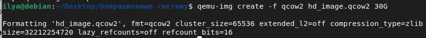
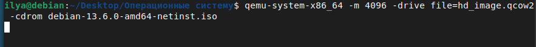
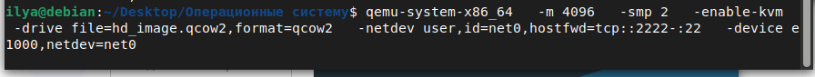
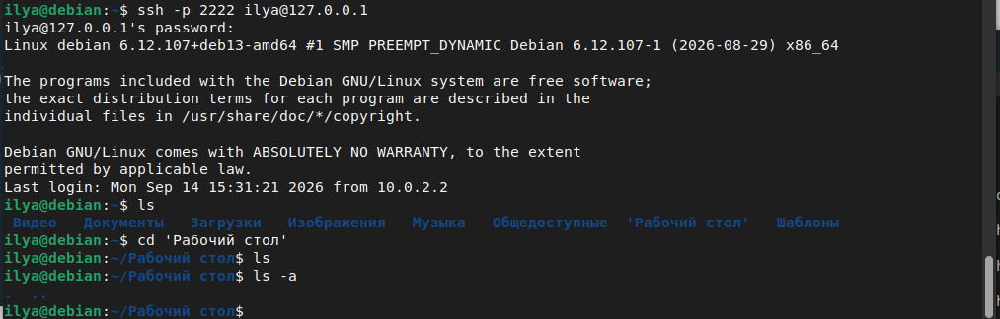
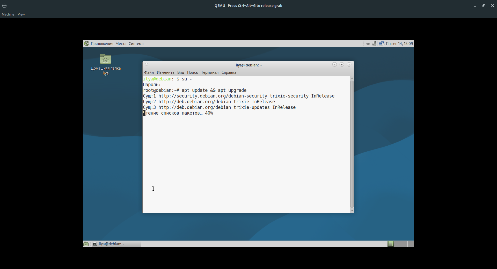

# Лабораторные работы: Введение в виртуальные машины и установка Debian

Данный репозиторий содержит материалы лабораторных работ. В этом руководстве описан процесс создания виртуальной машины (ВМ), установки на нее операционной системы Debian, настройки сети, подключения по SSH и обновления системы.

## Требования
*   Хост-система на базе Linux (в примерах используется Debian).
*   Установленные пакеты `qemu-system-x86_64`, `qemu-img` и `qemu-kvm`.
*   ISO-образ установщика Debian (в примере используется `debian-13.6.0-amd64-netinst.iso`).

## Пошаговая инструкция

### 1. Создание виртуального жесткого диска
Перед началом работы необходимо создать файл диска формата `qcow2`, на который будет установлена система. Выделим для него 30 ГБ.

На скриншоте видно успешное создание файла с параметрами форматирования.

### 2. Установка операционной системы Debian
Для первоначальной установки необходимо запустить ВМ с подключенным ISO-образом. В данном случае мы выделяем 4 ГБ оперативной памяти и указываем наш созданный диск.

При запуске в меню установщика выбираем Graphical install (Графическая установка) и следуем инструкциям на экране.

### 3. Запуск ВМ и настройка сети (Проброс портов)
После успешной установки ОС, для дальнейшей работы нам нужно запускать ВМ уже без ISO-образа, но с настроенной сетью.

Для того чтобы иметь возможность подключаться к ВМ по SSH с хост-машины, мы используем проброс портов: порт 2222 на хосте будет перенаправляться на порт 22 внутри виртуальной машины.

Команда для повседневного запуска ВМ:

Примечание: Флаг -enable-kvm обеспечивает аппаратное ускорение, -smp 2 выделяет 2 ядра процессора.

### 4. Подключение к виртуальной машине по SSH
После запуска ВМ (из пункта 3), откроем терминал на хост-машине и подключимся к ней по SSH, используя проброшенный порт 2222:

### 5. Проверка и обновление системы
Внутри виртуальной машины (через SSH или в графическом терминале) необходимо обновить пакеты. Для этого повышаем привилегии до суперпользователя и запускаем обновление:

После 'su -' Введите пароль root. Система обновит списки пакетов и установит доступные обновления.

Важное примечание
После того как установка завершена, никогда не запускайте команду с флагом -cdrom снова (если только вы не хотите переустановить систему). Для всех последующих запусков используйте команду из пункта 3. Это позволит сохранять все изменения, сделанные внутри виртуальной машины.
